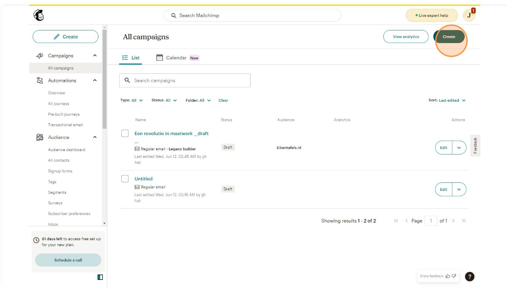
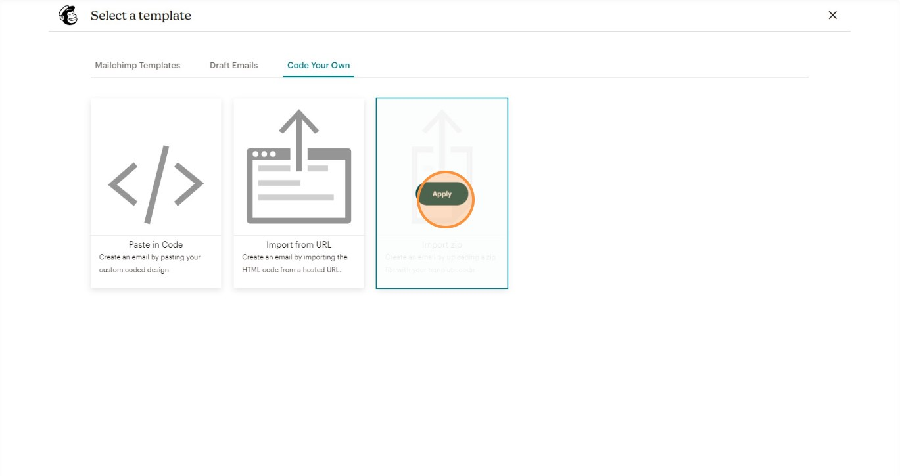
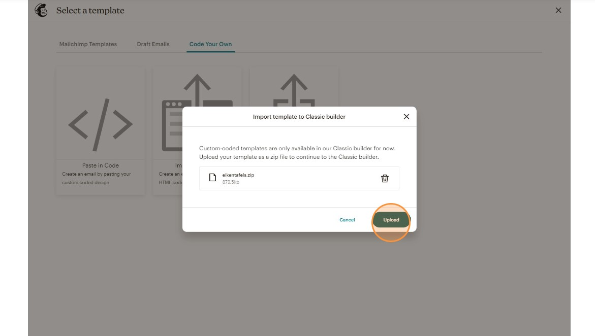

Email marketing remains one of the most effective ways to engage with your audience. Mailchimp is a popular platform for creating and managing email campaigns, and MJML (Mailjet Markup Language) is a powerful tool for designing responsive email templates. Combining the two can help you create visually appealing and functional email campaigns. Here’s a step-by-step guide on how to create a campaign in Mailchimp using an email template from MJML.

## Step 1: Prepare the mjml file that has been built into html

You need to create the MJML file inside a project folder like this:

```
| ProjectA
| - image.jpg
| - index.html
| - index.mjml
```

## Step 2: Import Your HTML Template into Mailchimp

### 2.1. Log in to Mailchimp

Log in to your Mailchimp account. If you don’t have an account, sign up for one at [Mailchimp's website](https://mailchimp.com/).

### 2.2. Navigate to [Champaign page](https://us17.admin.mailchimp.com/campaigns/)

### 2.3. Click "Create"



### 2.4. Fill the `Internal email name` And Click `Create email`


### 2.5. After that you can fill the information

the information like to, from, subject, send time & etc

### 2.6. Upload your design email

you can choose the content section by click the `Design email`, after that you can choose the `Code your Own` and choose the import zip. Before this, make sure you have compressed the project folder into zip



### 2.6. Upload your file



### 2.6. Click `Continue` to finish your campaign setup


### 2.7. Review and Send

Review your campaign to ensure everything looks correct. You can send a test email to yourself to double-check the design and content. Once you’re satisfied, click the “Send” button to launch your campaign.

## Conclusion

Creating a Mailchimp campaign with an MJML email template combines the best of both worlds: the flexibility and responsiveness of MJML with the powerful email marketing capabilities of Mailchimp. By following these steps, you can design beautiful email templates in MJML, import them into Mailchimp, and create effective email campaigns that engage your audience. Happy emailing!
