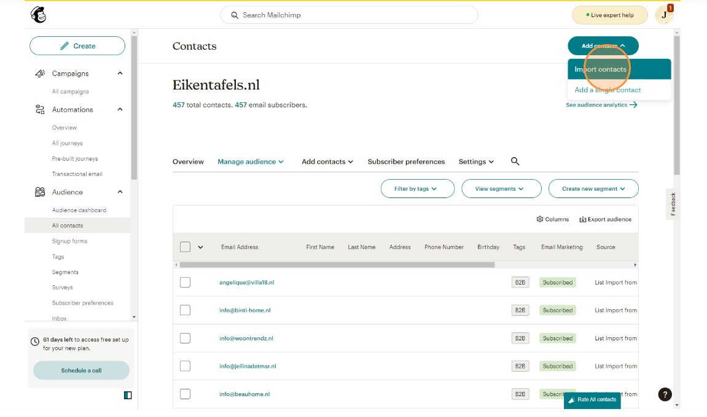
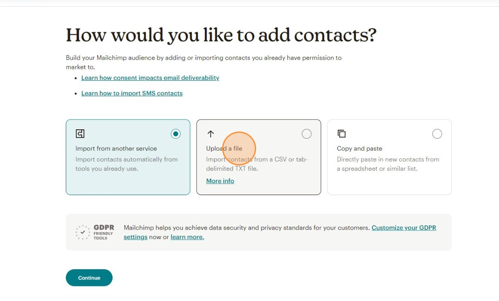
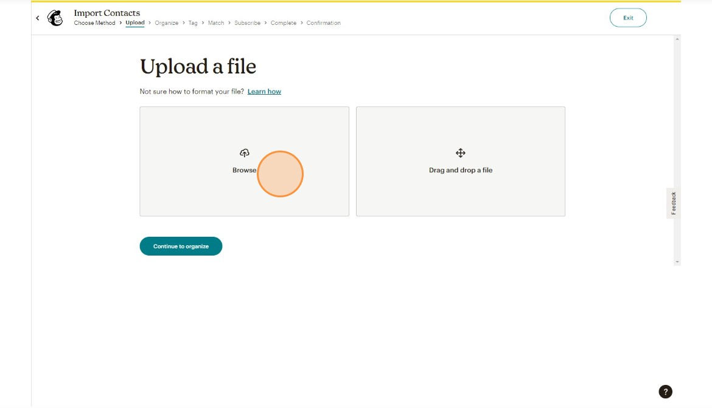
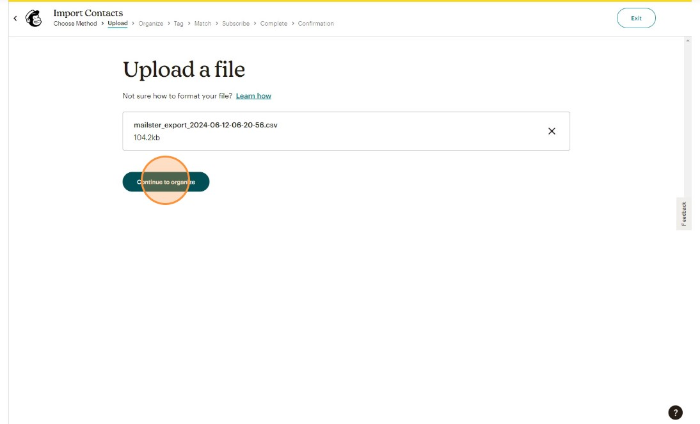
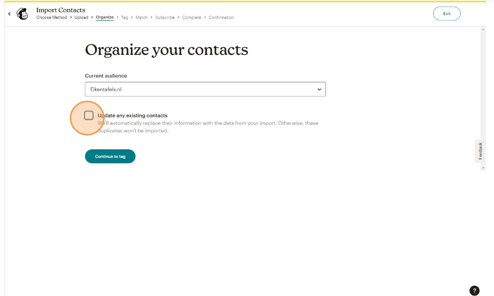
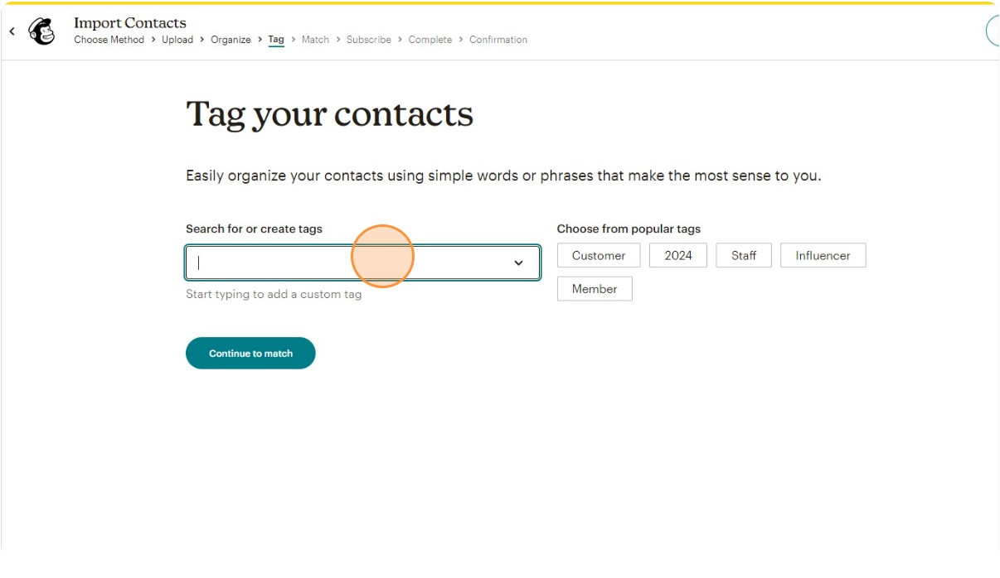
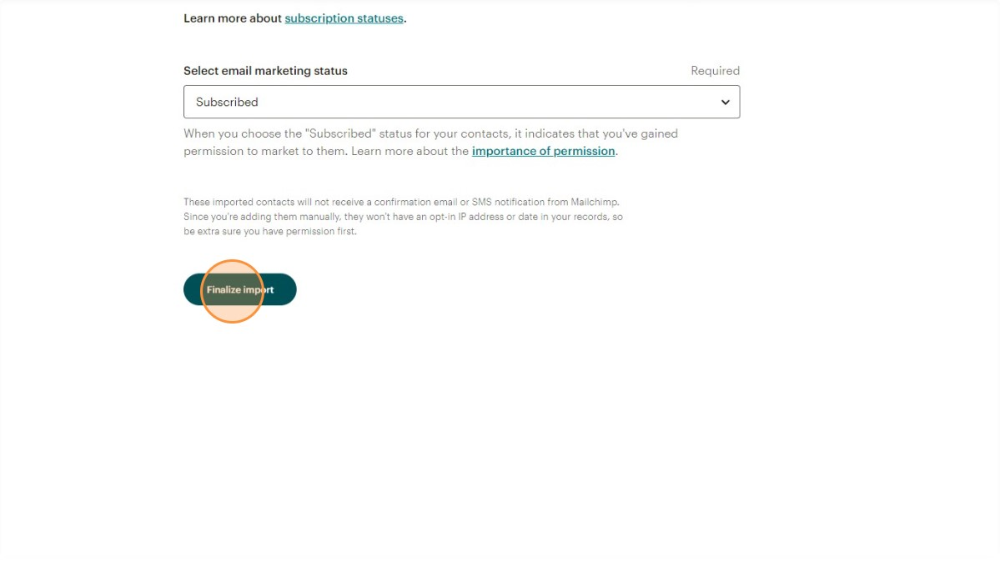
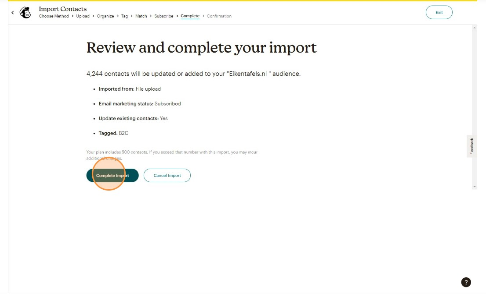

Managing your email contacts efficiently is crucial for successful email marketing campaigns. Mailchimp allows you to import contacts from various sources, including .CSV files, and organize them for better targeting and communication. Here’s a step-by-step guide on how to import and organize contacts from a .CSV file in Mailchimp.

## Step 1: Prepare Your .CSV File

Before importing your contacts, ensure your .CSV file is correctly formatted. Each column should have a header that describes the type of data it contains (e.g., Email Address, First Name, Last Name). Here’s a basic example:

```csv
johndoe@example.com,
janedoe@example.com,
```

## Step 2: Log in to Mailchimp

1. Log in to your Mailchimp account. If you don’t have an account, sign up at Mailchimp's website.
2. Once logged in, navigate to the “Audience” tab.

## Step 3: Import Contacts from .CSV

1. In the “Audience” tab, click on “All contacts”.
2. Click on the “Import” button.
3. Choose the “Upload a file” option and click “Continue”.




## Step 4: Upload Your .CSV File

1. Click on the “Browse” button and select your .CSV file from your computer.
2. Click “Continue to Match” after the file is uploaded.




## Step 5: Fill the `current audience` and check the `update any existing contacts`



## Step 6: Organize Contacts

1. On the “Organize” page, you can assign tags to your contacts to categorize them. Tags help in segmenting your audience for targeted campaigns.
2. Add tags by typing them in the “Tag contacts” field.
3. Choose if you want to update existing contacts by checking the “Update existing contacts” box.
4. Click “Continue to Review”.




## Step 7: Review and Import

1. Review the details of your import to ensure everything is correct.
2. Click “Import” to start the process.
3. Mailchimp will notify you once the import is complete. This can take a few minutes, depending on the number of contacts.



## Conclusion

Importing and organizing contacts from a .CSV file in Mailchimp is a straightforward process that can significantly enhance your email marketing efforts. By following these steps, you can ensure your contacts are accurately imported and well-organized, allowing you to create targeted and effective email campaigns. Happy organizing!
